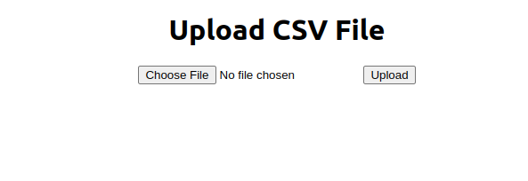
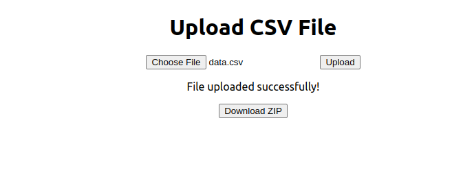
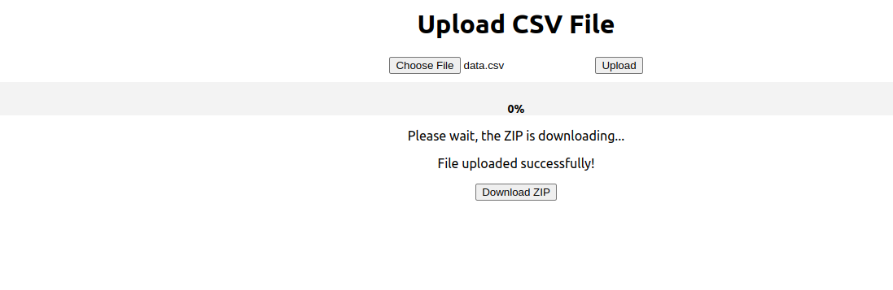
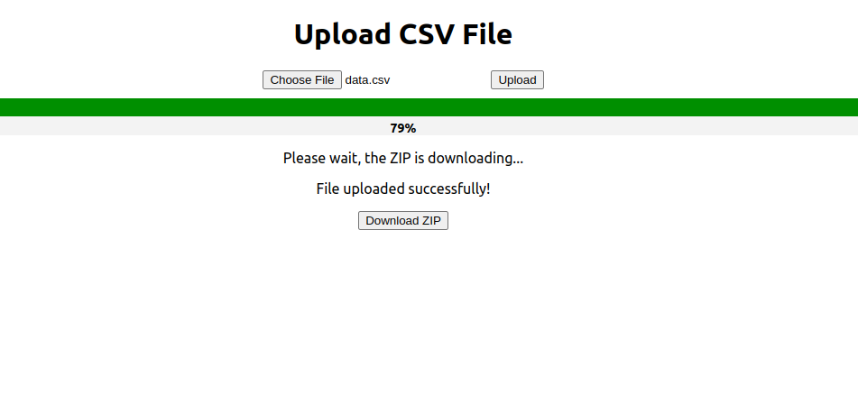
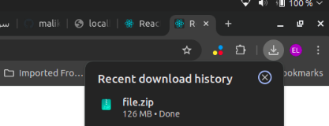
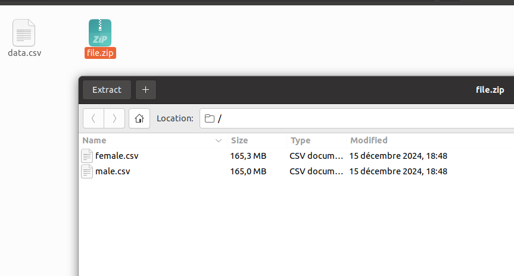
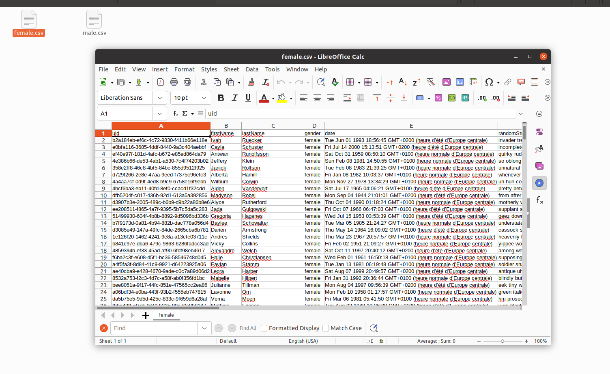
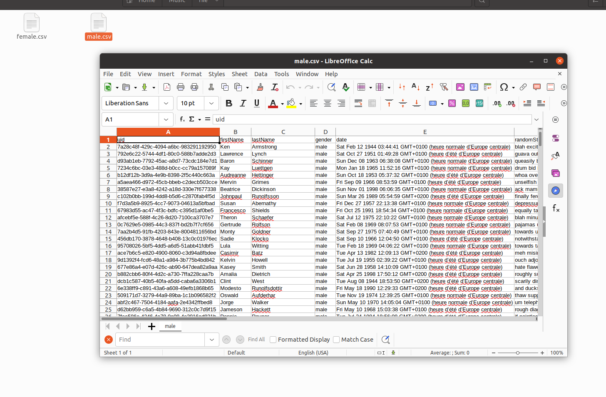

# CSV File Upload and Gender-Based CSV Splitter

This project consists of two main sections: **Front-End** (React) and **Back-End** (Node.js). The objective of the project is to allow users to upload a CSV file, split its content based on gender, and download the resulting CSV files as a zipped archive.

## Front-End Section (React)

### Features
- A single-page React interface containing a CSV file upload form.
- Displays a progress indicator during the file upload.
- Displays an appropriate error message if there is an issue during the upload.

### How to Run the Front-End
1. Navigate to the `frontend` directory.
2. Install the required dependencies:
   ```bash
   npm install
   ```
3. Start the React development server:
   ```bash
   npm start
   ```

The front-end should be accessible at `http://localhost:3000` in your browser.

## Back-End Section (Node.js)

### Features
- A Node.js API with a route to handle CSV file uploads.
- The route efficiently handles CSV files, separating them based on gender.
- The resulting CSV files are compressed into a `.zip` file and sent back to the client.
- Error handling for issues during the file upload or processing.

### How to Run the Back-End
1. Navigate to the `backend` directory.
2. Install the required dependencies:
   ```bash
   npm install
   ```
3. Start the Node.js server:
   ```bash
   npm start
   ```

The back-end should be accessible at `http://localhost:5000`.

## Running the Full Project

1. Clone the repository:
   ```bash
   git clone <your-repository-url>
   ```
2. Install the required dependencies for both front-end and back-end:
   - In the `frontend` directory:
     ```bash
     npm install
     ```
   - In the `backend` directory:
     ```bash
     npm install
     ```

3. Start both the front-end and back-end servers:
   - In the `frontend` directory, run:
     ```bash
     npm start
     ```
   - In the `backend` directory, run:
     ```bash
     npm start
     ```

Once both servers are running, you can access the React application at `http://localhost:3000`, and the back-end API will be available at `http://localhost:5000`.

## Error Handling

Both the front-end and back-end have basic error handling for common issues such as:
- Incorrect file format
- Upload interruptions
- Processing errors

## License

This project is licensed under the MIT License.


















